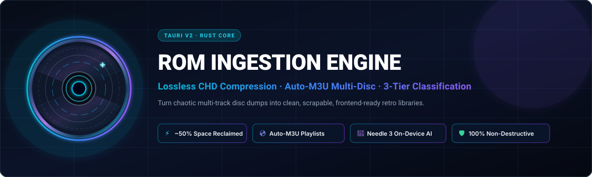
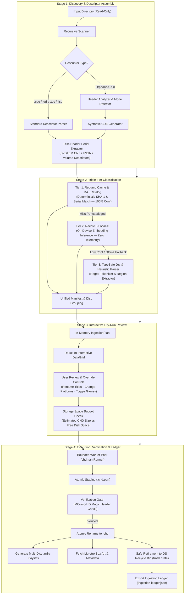

<div align="center">

  

  <p align="center">
    <strong>Turn chaotic multi-track disc dumps into clean, space-efficient, scrapable retro gaming libraries.</strong>
  </p>

  <p align="center">
    <a href="https://tauri.app/"></a>
    <a href="https://www.rust-lang.org/"></a>
    <a href="https://react.dev/"></a>
    
    
    
    
    <a href="https://opensource.org/licenses/MIT"></a>
    
  </p>

</div>

---

The **ROM Ingestion Engine** is a high-performance desktop application engineered with **Tauri v2**, **Rust**, and **React 19** that turns fragmented, multi-track disc images into pristine, storage-optimized retro gaming libraries. Built specifically for retro handheld consoles and modern emulation frontends—including **OnionOS / GarlicOS**, **Anbernic Stock OS**, **ES-DE (EmulationStation)**, and **Batocera / Knulli**—it automates discovery, triple-tier intelligent classification, lossless CHD v5 compression, multi-disc `.m3u` orchestration, and Libretro box art ingestion with guaranteed non-destructive dry-run safety.

---

## Table of Contents

- [The Problem & Before/After Transformation](#the-problem--beforeafter-transformation)
- [Architecture & 4-Stage Pipeline](#architecture--4-stage-pipeline)
- [Key Features & Technical Moat](#key-features--technical-moat)
- [Frontend Preset Compatibility Matrix](#frontend-preset-compatibility-matrix)
- [The 4-Step UI Wizard Journey](#the-4-step-ui-wizard-journey)
- [Supported Platforms & Disc Formats](#supported-platforms--disc-formats)
- [Safety, Privacy & Legal Notice](#safety-privacy--legal-notice)
- [Build From Source & Developer Guide](#build-from-source--developer-guide)
- [Contributing & License](#contributing--license)

---

<a id="the-problem"></a>
<a id="the-problem--beforeafter-transformation"></a>
## The Problem & Before/After Transformation

Disc-based retro emulation (PSX, Sega Saturn, Dreamcast, Sega CD, PC Engine CD) is plagued by format chaos:

1. **Massive Storage Bloat**: Uncompressed `.bin` dumps consume 650 MB to 1.2 GB per disc, rapidly exhausting microSD cards.
2. **Multi-Track Clutter**: A single game often splits into dozens of audio files (`Track 01.bin` through `Track 42.bin`), swamping file managers.
3. **Broken Multi-Disc Playlists**: Multi-disc epics like *Final Fantasy VII* or *Shenmue* generate 3 to 4 distinct entries in your handheld's menu, fragmenting save states and breaking immersion.
4. **Missing or Corrupted CUE Sheets**: Orphaned `.bin` tracks with broken `.cue` files fail to boot or drop CD-DA background audio.
5. **Scraper Failure**: Inconsistent naming schemas prevent scrapers from downloading cover art.

### The Transformation

Here is how the ROM Ingestion Engine cleans a typical PlayStation and Saturn collection:

```text
BEFORE (Chaotic Raw Dumps — 4.8 GB, 23 files)
📂 Raw_Downloads/
├── 📄 Chrono Cross (USA) (Disc 1).cue
├── 📄 Chrono Cross (USA) (Disc 1) (Track 1).bin
├── 📄 Chrono Cross (USA) (Disc 1) (Track 2).bin
├── 📄 Chrono Cross (USA) (Disc 2).cue
├── 📄 Chrono Cross (USA) (Disc 2) (Track 1).bin
├── 📄 Chrono Cross (USA) (Disc 2) (Track 2).bin
├── 📄 Wipeout 2097 (Europe) (Track 01).bin
├── 📄 Wipeout 2097 (Europe) (Track 02).bin
├── 📄 Wipeout 2097 (Europe) (Track 03).bin
├── 📄 Wipeout 2097 (Europe) (Track 04).bin  [Missing CUE Sheet!]
└── 📄 Panzer Dragoon Saga (USA) (Disc 1..4) [Dozens of loose tracks...]

                                  ⬇
               ⚡ INGESTED VIA ROM INGESTION ENGINE ⚡
                                  ⬇

AFTER (Pristine Handheld Library — 2.2 GB [~54% Reclaimed], Clean Menus)
📂 MicroSD_Card/ROMS/
├── 📂 PS/
│   ├── 📄 Chrono Cross (USA).m3u               <-- Single menu entry for both discs
│   ├── 📄 Wipeout 2097 (Europe).chd            <-- Auto-reconstructed CUE + lossless CHD
│   ├── 📂 .discs/                               <-- Hidden disc storage (keeps root clean)
│   │   ├── 📄 Chrono Cross (USA) (Disc 1).chd
│   │   └── 📄 Chrono Cross (USA) (Disc 2).chd
│   └── 📂 Imgs/                                 <-- Preset-aligned box art from Libretro CDN
│       ├── 🖼️ Chrono Cross (USA).png
│       └── 🖼️ Wipeout 2097 (Europe).png
└── 📂 SATURN/
    ├── 📄 Panzer Dragoon Saga (USA).m3u        <-- 1 unified playlist for all 4 discs
    ├── 📂 .discs/
    │   ├── 📄 Panzer Dragoon Saga (USA) (Disc 1).chd
    │   ├── 📄 Panzer Dragoon Saga (USA) (Disc 2).chd
    │   ├── 📄 Panzer Dragoon Saga (USA) (Disc 3).chd
    │   └── 📄 Panzer Dragoon Saga (USA) (Disc 4).chd
    └── 📂 Imgs/
        └── 🖼️ Panzer Dragoon Saga (USA).png
```

---

<a id="architecture--pipeline"></a>
<a id="architecture--4-stage-pipeline"></a>
<a id="architecture"></a>
## Architecture & 4-Stage Pipeline

The engine combines a **Rust core** for blazingly fast filesystem operations and thread safety with a reactive **React 19** frontend orchestrated over Tauri v2 IPC channels.



### Core Architectural Invariants

- **Strict Non-Destructive Scanning**: The source directory is accessed strictly in read-only mode during discovery and dry-run planning.
- **Atomic `.part` Staging**: Every CHD is compressed into a temporary `.part` file. Only when compression completes with exit code 0 and passes magic byte verification is it renamed to its final target path.
- **Magic Byte Verification**: Output files are verified by reading the first 8 bytes to confirm the official `MComprHD` (MAME Compressed Hunks of Data) file signature.
- **Bounded Concurrency**: Compression tasks run through a bounded worker pool configured to prevent CPU exhaustion and disk I/O bottlenecks.
- **Zero-Loss CD-DA Audio**: Multi-track audio is encoded with lossless FLAC rather than lossy codecs, ensuring bit-perfect Redump audio reproduction.

---

<a id="key-features--technical-moat"></a>
<a id="key-features"></a>
## Key Features & Technical Moat

### 🗜️ 1. Lossless CHD v5 Compression
Reclaim **40% to 60%** of your SD card storage. CHD (Compressed Hunks of Data) v5 combines LZMA and zlib compression for program data with lossless FLAC audio compression for CD-DA audio tracks. Compatible with RetroArch cores (PCSX ReARMed, Beetle PSX, Genesis Plus GX, Flycast, Mednafen) and standalone emulators out of the box.

### 🧠 2. Triple-Tier Classification Engine
Accurately categorizes games and identifies multi-disc sets even with mangled filenames:
- **Tier 1: Redump Hash & Serial DAT Catalog (`redumpcache`)**: Matches disc SHA-1 checksums and disc header serials (e.g., `SLUS-00067`, `HDR-0010`) against official Redump DAT catalogs with 100% confidence.
- **Tier 2: Needle 3 Local AI (`needleai`)**: An on-device neural sidecar that uses semantic embeddings to resolve obscure titles, translation patches, and homebrew releases—with zero telemetry and no network access.
- **Tier 3: TypeSafe Jev & Heuristic Parser (`jevai` / `fallback`)**: Fast, deterministic tokenization that extracts disc indices (`Disc 1`, `CD2`), region tags (`(USA)`, `(Japan)`), and sanitizes special characters.

### 💿 3. Zero-Duplicate Multi-Disc & M3U Orchestration
Multi-disc titles (*Final Fantasy IX*, *Resident Evil 2*, *Metal Gear Solid*) are automatically grouped. Discs are organized into a clean `.discs/` subfolder, and a single `.m3u` playlist is generated in the system folder. Your handheld interface displays **one clean entry per game** instead of 4 duplicated titles.

### ⬇️ 4. 1-Click `chdman` Auto-Downloader
No manual compiler setups or hunt for CLI tools. The engine automatically detects whether `chdman` is present in your system PATH. If missing, it downloads the verified official binary for your platform (Windows, macOS Apple Silicon/Intel, Linux) with SHA-256 integrity validation.

### 🖼️ 5. Automated Libretro Box Art Ingestion
Fetches high-resolution community-maintained cover art, in-game screenshots, and title screens from the Libretro Thumbnails CDN with zero API keys required. Images are automatically renamed and placed into the correct directories required by your frontend preset (`Imgs/`, `media/covers/`, or `images/`).

### 🛡️ 6. Dry-Run Safety & Audit Ledger
Review exactly what will be created, where files will be moved, and how much space will be reclaimed before compressing a single byte. Completed runs generate an `ingestion-ledger.json` containing exact source hashes, output paths, and space metrics. Original files can optionally be moved to the OS Recycle Bin (`trash` crate)—never permanently deleted without confirmation.

---

<a id="frontend-preset-matrix"></a>
<a id="frontend-preset-compatibility-matrix"></a>
## Frontend Preset Compatibility Matrix

The engine provides tailor-made directory structures for all major retro handheld firmware ecosystems:

| Frontend Preset | Typical Handhelds & Hardware | Platform Folder Convention | Multi-Disc M3U Location | Disc Staging Path | Box Art / Media Path | Gamelist Integration |
|---|---|---|---|---|---|---|
| **Anbernic Stock OS** | RG35XX, RG35XX+, RG40XX, RG-Cube, RG353 | `ROMS/{PS, SATURN, DC, MDCD, PCE}` | `ROMS/<SYS>/<Game>.m3u` | `ROMS/<SYS>/.discs/` | `ROMS/<SYS>/Imgs/<Stem>.png` | Filesystem auto-scan |
| **OnionOS / GarlicOS** | Miyoo Mini, Miyoo Mini Plus, RG35XX | `Roms/{PS, SEGASATURN, DREAMCAST, SEGACD, PCECD}` | `Roms/<SYS>/<Game>.m3u` | `Roms/<SYS>/.discs/` | `Roms/<SYS>/Imgs/<Stem>.png` | Filesystem auto-scan |
| **ES-DE (EmulationStation)** | Steam Deck, Odin 2, Retroid Pocket, PC, Mac | `ROMs/{psx, saturn, dreamcast, segacd, pcenginecd}` | `ROMs/<sys>/<Game>.m3u` | `ROMs/<sys>/.discs/` | `ROMs/<sys>/media/covers/<Stem>.png` | `ES-DE/gamelists/<sys>/gamelist.xml` |
| **Batocera / Knulli** | Anbernic RG35XX-H, Raspberry Pi, Orange Pi | `roms/{psx, saturn, dreamcast, segacd, pcenginecd}` | `roms/<sys>/<Game>.m3u` | `roms/<sys>/.discs/` | `roms/<sys>/images/<Stem>-thumb.png` | Local `gamelist.xml` |
| **Custom Standard** | Any DIY setup, Batocera fork, or custom NAS | User-configurable per platform | Configurable root | User-configurable | `media/covers/` or configurable | Configurable |

---

<a id="the-4-step-wizard-journey"></a>
<a id="the-4-step-ui-wizard-journey"></a>
## The 4-Step UI Wizard Journey

```text
┌─────────────────┐     ┌──────────────────┐     ┌─────────────────────┐     ┌──────────────────┐
│   1. SETUP &    │ ──> │    2. DRY-RUN    │ ──> │   3. COMPRESSION    │ ──> │   4. SUMMARY &   │
│     PRESET      │     │      REVIEW      │     │      EXECUTION      │     │      LEDGER      │
└─────────────────┘     └──────────────────┘     └─────────────────────┘     └──────────────────┘
```

### Step 1: Setup & Preset Configuration
- Select your raw dump source directory and target destination folder (microSD card or local drive).
- Pick your target frontend preset (**Anbernic Stock OS**, **OnionOS**, **ES-DE**, **Batocera**, or **Custom**).
- Toggle box art scraping options (Covers, In-Game Screenshots, Title Screens).
- Manage official Redump DAT catalogs or download missing platform definitions with one click.
- Automatic verification of `chdman` with one-click background downloader.

### Step 2: Interactive Dry-Run Review
- Inspect the complete transformation plan before any writes occur.
- Review confidence scores from the triple-tier classifier.
- Inline-edit canonical game titles or retarget platforms directly from the data grid.
- Toggle individual games on or off.
- View real-time disk space budget calculations (input size vs. projected CHD size vs. free destination space).

### Step 3: High-Throughput Compression & Scrape
- Concurrent, CPU-throttled batch compression powered by `chdman`.
- Live visual progress bars displaying overall and per-game compression percentages.
- Background asynchronous downloading of Libretro box art assets.
- Live console log stream with active status reporting for every disc.

### Step 4: Completion Summary & Device Checklist
- Overview of total storage reclaimed and overall compression ratio (e.g. `Saved 18.4 GB · 54% reduction`).
- Device-specific post-ingestion tips (e.g., refresh game lists, retroarch config recommendations).
- Quick shortcut to open the destination library in your system file explorer.
- Audit ledger review and export (`ingestion-ledger.json`).

---

<a id="supported-platforms--disc-formats"></a>
<a id="supported-platforms"></a>
## Supported Platforms & Disc Formats

| Platform | Short Code | Input Descriptors Supported | Output Compression | M3U Multi-Disc | Disc Identification Methods |
|---|---|---|---|---|---|
| **Sony PlayStation** | `psx` | `.cue` + multi `.bin`, `.iso`, orphaned `.bin` | Lossless CHD v5 (FLAC audio) | Yes (`.discs/` + `.m3u`) | `SYSTEM.CNF`, `PS-X EXE`, Redump SHA-1 |
| **Sega Saturn** | `saturn` | `.cue` + multi `.bin`, `.iso`, `.toc` | Lossless CHD v5 (FLAC audio) | Yes (`.discs/` + `.m3u`) | `IP.BIN` header (`SEGA SEGASATURN`) |
| **Sega Dreamcast** | `dreamcast` | `.gdi` + `.bin`/`.raw`, `.cue`, `.iso` | Lossless CHD v5 (GD-ROM) | Yes (`.discs/` + `.m3u`) | `IP.BIN` header (`SEGA SEGAKATANA`) |
| **Sega CD / Mega-CD** | `segacd` | `.cue` + multi `.bin`, `.iso` | Lossless CHD v5 (FLAC audio) | Yes (`.discs/` + `.m3u`) | Security header (`SEGADISCSYSTEM`) |
| **PC Engine CD / TG-CD** | `pcecd` | `.cue` + multi `.bin`, `.iso` | Lossless CHD v5 (FLAC audio) | Yes (`.discs/` + `.m3u`) | Track layout & Redump hash catalog |

---

<a id="safety-privacy--legal-notice"></a>
<a id="safety--privacy"></a>
## Safety, Privacy & Legal Notice

### 🛡️ Non-Destructive Guarantee
- **Read-Only Input Operations**: The scanning and planning phases never modify or delete source files.
- **Fail-Safe Staging**: Files are compressed to temporary `.part` containers and verified against official CHD v5 magic headers before being finalized.
- **Safe Retirement**: If source cleanup is enabled, original files are staged to the OS Recycle Bin (`trash` crate)—never permanently unlinked without system recovery options.

### 🔒 100% Local-First Privacy & Zero Telemetry
- **On-Device Classification**: The Needle 3 AI classifier runs 100% locally on your machine.
- **Zero Telemetry**: No filenames, paths, hashes, or machine identifiers are ever logged, tracked, or transmitted (`NEEDLE_TELEMETRY=0`, `DO_NOT_TRACK=1`).
- **External Connections**: Network traffic is strictly limited to downloading official `chdman` releases, public Redump DATs, and public Libretro box art assets.

### ⚖️ Legal & Compliance
The ROM Ingestion Engine is an open-source library organizer and compression utility. **It does NOT bundle, distribute, host, or link to any copyrighted game ROMs, disc images, or proprietary console BIOS files.** Users must provide their own legally acquired backups.

---

<a id="build-from-source--developer-guide"></a>
<a id="build-from-source"></a>
## Build From Source & Developer Guide

### Prerequisites

- **Node.js**: `v20.x` or later with `npm`
- **Rust**: `1.75+` (2021 edition) via `rustup`
- **C++ Build Tools**:
  - **Windows**: Visual Studio 2022 with C++ Desktop Development workload
  - **macOS**: Xcode Command Line Tools (`xcode-select --install`)
  - **Linux**: `build-essential`, `libwebkit2gtk-4.1-dev`, `libappindicator3-dev`, `librsvg2-dev`

### Quickstart

1. **Clone the repository**:
   ```bash
   git clone https://github.com/toilmonkey0-cyber/rom-ingestion-engine.git
   cd rom-ingestion-engine
   ```

2. **Install frontend dependencies**:
   ```bash
   npm install
   ```

3. **Run the development application**:
   ```bash
   npm run tauri dev
   ```

### Running Test Suites

Run the frontend test suite with Vitest:
```bash
npm test
```

Run the backend test suite with Cargo:
```bash
cargo test --manifest-path src-tauri/Cargo.toml
```

---

<a id="contributing--license"></a>
<a id="contributing"></a>
## Contributing & License

Contributions are welcome! Whether you are adding a new handheld frontend preset, improving classification accuracy, or optimizing the compression pipeline, please follow these steps:

1. Fork the repository.
2. Create a feature branch: `git checkout -b feat/my-new-feature`.
3. Ensure all tests pass (`npm test` and `cargo test`).
4. Commit your changes following conventional commits: `git commit -m "feat: add new frontend preset"`.
5. Open a Pull Request using our [Pull Request Template](.github/PULL_REQUEST_TEMPLATE.md).

For bugs or feature requests, please use our structured [Issue Templates](.github/ISSUE_TEMPLATE/).

### License

Distributed under the [MIT License](https://opensource.org/licenses/MIT).

Copyright © 2026 [toilmonkey0-cyber](https://github.com/toilmonkey0-cyber).
